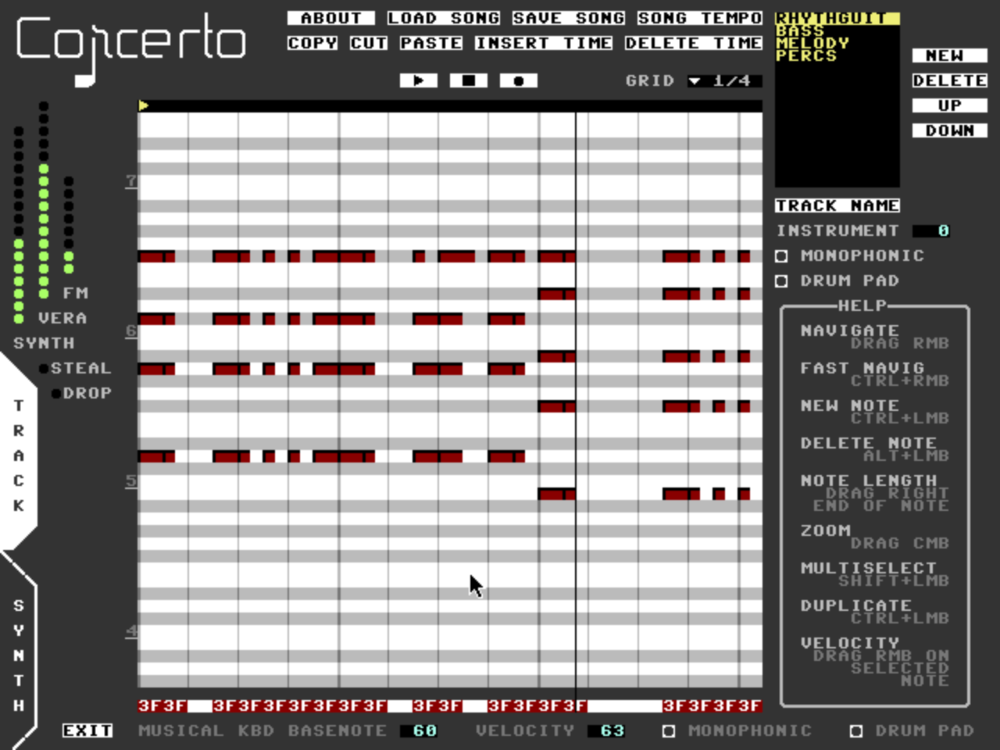
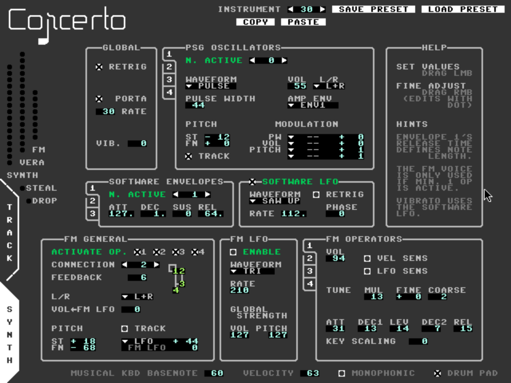

# Welcome to Concerto Multitrack

|  |  |
| ---- | ---- |

Concerto Multitrack is a program for making music on the Commander X16. It aims to unlock the full potential of 16 PSG oscillators plus 8 FM voices. Some of its features are

* Intuitive, mouse-controlled user interface  
* “Keyboard roll” style music editor  
* Up to 16 tracks (incl. drum tracks)  
* Up to 32 instruments per song  
* Powerful synthesizer  
  * Combine up to four VERA oscillators and one FM voice into one sound  
  * Software envelopes and LFO  
* Easy polyphony  
* 127 Hz engine  
  * control everything with 8 ms precision  
  * Smoother/snappier modulations than typical 60 Hz engines  
* 100+ high quality preset instruments

Samples are not supported, unfortunately. But don’t worry: Concerto is capable of producing a large variety of sounds, including drums. The presets that come with the software should be enough to get you started.

# Contents

0. [**Contents**](#contents)
1. [**Hardware Requirements**](#hardware-requirements)
2. [**Starting Concerto Multitrack**](#starting-concerto-multitrack)
    * [From BASIC](#from-basic)
    * [With the Emulator](#with-the-emulator)
3. [**Overview**](#overview)
4. [**The Musical Keyboard**](#the-musical-keyboard)
5. [**The Sound Engine**](#the-sound-engine)
    * [Feature Overview](#feature-overview)
    * [Indicator Lights](#indicator-lights)
    * [Voice Stealing and Dropping](#voice-stealing-and-dropping)
6. [**Track Page**](#track-page)
    * [Loading and Saving Songs](#loading-and-saving-songs)
    * [Playback Controls](#playback-controls)
    * [What is a Track?](#what-is-a-track?)
    * [Managing tracks](#managing-tracks)
    * [Note editing](#note-editing)
    * [Track Settings](#track-settings)
    * [Song Tempo](#song-tempo)
7. [**Synth Page**](#synth-page)
    * [Loading and Saving Instruments](#loading-and-saving-instruments)
    * [Synthesizer Overview](#synthesizer-overview)
    * [Global Settings](#global-settings)
    * [Software Envelopes](#software-envelopes)
    * [Software LFO](#software-lfo)
    * [PSG Oscillators](#psg-oscillators)
    * [About FM Synthesis](#about-fm-synthesis)
    * [FM General](#fm-general)
    * [FM Operators](#fm-operators)
    * [FM LFO](#fm-lfo)
8. [**Keyboard Shortcuts**](#keyboard-shortcuts)
9. [**Where is the undo feature?**](#where-is-the-undo-feature)
10. [**How To…?**](#how-to)
11. [**Known Limitations/Problems**](#known-limitationsproblems)

# Hardware Requirements

Concerto Multitrack runs on the unexpanded Commander X16:

* 8 MHz 65C02 or 65C816 processor  
* 512 kB banked RAM  
* SD card  
* Three-button mouse  
* 80x60 characters capable screen

# Starting Concerto Multitrack

## From BASIC

Navigate to the directory on the SD card that contains CONCERTO.PRG. For example:  
> `@CD: AUDIO/CONCERTO`  

Then load and run as usual:  
> `LOAD “CONCERTO.PRG”`  
> `RUN`  

Concerto expects the current working directory to be set correctly. Loading the program from a different location will not work:  
> `LOAD “AUDIO/CONCERTO/CONCERTO.PRG” : REM THIS WILL NOT WORK!`

Tip: You can view this documentation directly on the Commander X16 with the built-in text editor. Using the ISO THIN charset is recommended.

## With the Emulator

Recommended settings for the emulator are  
> `x16emu -fsroot <*path/to/concerto*> -prg CONCERTO.PRG -run -scale 2 -abufs 8 -capture -nokeyboardcapture`

Capturing the mouse makes it behave more predictably.

# Overview

Concerto Multitrack’s user interface is separated into two pages: the Track page and the Synth page. Which page is currently shown can be selected with the mouse at the bottom left of the screen, or by pressing TAB.

The Track page allows you to compose music by placing notes inside a track, defining which instrument plays on each track, and by adding more tracks for different instruments.

The Synth page allows you to configure your sounds. Here, you can load (or save) instruments from the SD card and start tweaking them, or create completely new sounds. There are 32 instrument slots. Every instrument can be loaded into every slot, but the last 16 slots (16 to 31\) are drum slots. They can be played via so-called drum tracks – more about them later. The little box with arrows at the top shows which of the 32 instrument slots is currently selected and allows you to browse through them.

The musical keyboard helps you to easily pre-listen the currently selected instrument. Some related settings are always visible at the bottom of the screen.

Most of the GUI controls should be very intuitive: buttons, tabs, checkboxes, drop down menus. One potentially unintuitive control is the “drag edit”. Whenever there is a light blue number inside a black box, and there are no arrows to click on, then that’s a drag edit. You modify its value by clicking on it and dragging the mouse pointer up or down. Some drag edits contain a “decimal point”. By either holding the left or right mouse button, you can view and edit either the coarse or fine portion, respectively.

# The Musical Keyboard

Concerto turns a part of the keyboard into a musical one. The currently selected synth sound can be played manually to preview sounds, to improvise solo or alongside your composition. During sound design, it is an essential tool to get fast feedback, and it can even be used to quickly navigate the drum slots.

Keys A, S, D etc. all the way to the right side are the white keys. Black keys are mapped to W, E, T etc. They can be played polyphonically\!

The MK always plays the instrument currently shown on the Synth page. When a track is selected, both the synth page and the MK switch to that track’s instrument. You can also play the keyboard like a drum kit, and the sound played last is loaded in the Synth page. This is useful to quickly navigate to the instrument slot you want to edit.

The options at the very bottom of the UI are all related to the MK:

* Base note controls the pitch of the leftmost key (A) and thereby acts to transpose the pitch range accessible from the MK. Transposition can also be adjusted via the keyboard by pressing Z (down one octave) or X (up one octave).  
* Velocity is the volume of the MK. It also defines the volume of any new notes drawn.  
* Monophonic: If active, only one note can be played at once. In conjunction with the portamento and retrigger settings, this lets you play in typical “monosynth” style.  
* Drum pad: If active, each key plays one instrument of the 16 drum slots.

Tip \#1: In order to align the leftmost key A with the first drum slot, set the base note to a multiple of 16, e.g. by pressing Z once to set the base note to 48\.

Tip \#2: The base note and velocity edits are so close to the bottom that there is little room for reducing the value by dragging the mouse down. You can drag upwards to the max value and continue upwards for some distance. Drag the mouse down again while still holding the mouse button down, and you will have the full range of values available.

# The Sound Engine

This chapter outlines the capabilities of Concerto Multitrack, and thus lets you understand what you can and cannot do with it, at a high level.

## Feature Overview

Concerto exposes two out of the three built-in sound generators of the Commander X16 via its built-in synthesizer engine: the PSG oscillators and FM. PCM (sample playback) is currently not supported.

PSG refers to the 16 programmable sound generators on the VERA module. The FM (frequency modulation) synthesizer chip has 8 voices. The Concerto synthesizer allows to layer up to four PSG oscillators and one FM voice into a single instrument to achieve more complex sounds than would be possible with the individual sound generators alone. For more details, refer to the “Synth Page” chapter. Up to 32 such instruments can be defined.

There can be up to 16 tracks in a song. Each track can be polyphonic or monophonic. Normally, a track uses exactly one of the 32 instruments. Alternatively, the “drum track” option lets you use the track as a drum kit where you can play 16 of the 32 instruments. For more details about tracks, refer to the “Tracks Page” chapter.

The synthesizer engine has 16 voice polyphony, which is shared across all tracks and all instruments. Concerto takes care to automatically assign resources as needed.  
One consequence of there being only 16 voices is that, although there are 24 independent sound generators in total (8 FM \+ 16 PSG), only a maximum of 16 notes can play at any one time. To make use of all available sound generators, you need to use instruments which layer several oscillators (a capability of Concerto which I hope you quickly grow accustomed to).

## Indicator Lights

The columns of green “lights” to the left of the screen show how many of each resource are currently being used. The leftmost column shows the number of active synth voices, the middle column the number of PSG oscillators and the right column the number of FM voices. Below these, there are the Steal and Drop note indicators, which are explained in the next section.

## Voice Stealing and Dropping

It can happen that one of these three resources gets depleted. Whenever a note cannot allocate all needed resources directly, it attempts to steal them from other notes which are currently in the release phase, i.e. notes that have almost ended anyway. If this succeeds, the Steal indicator lights up for a brief moment. Typically, note stealing isn’t too noticeable and is therefore nothing to worry about. Especially when using instruments with long release tails, note stealing will occur quite often.

If on the other hand, note stealing was unsuccessful, the note that is attempted to be played won’t be played, and the Drop indicator lights up for a brief moment. Note drops should be avoided because part of your composition won’t be audible at all.  
Use the indicator lights to find out which resource is getting depleted. Strategies to mitigate resource depletion can be, but are not limited to:

* Shortening notes to reduce/avoid overlap,  
* Using polyphony more sparingly,  
* Using instruments with less oscillators (consider making a cheaper variant of an existing instrument for busy passages).

A rather technical note: Resource stealing prioritizes notes being played with the same instrument. E.g. suppose there are two notes currently in the release phase, one with instrument A and the other with instrument B. When a track attempts to play a note with instrument A but doesn’t find the resources, it will always steal them from the instrument A note. If there is no such note, then in the worst case, the stealing algo will kill all notes that are currently in the release phase and still not get everything it needs. This can happen e.g. if the new note needs an FM voice, but all notes currently in the release phase use only PSG oscillators.

# Track Page

As the name implies, the Track page is mostly about tracks. Moreover, song settings and playback controls are located here.

## Loading and Saving Songs

The correspondingly named buttons at the top of the track page open the load and save song dialogue, respectively. It shows all the song files located in the current folder, and it allows you to navigate to different folders by opening or “saving” them. Opening “..” lets you move upwards in the folder structure.  
The dialogue asks for confirmation before you overwrite an existing file.  
Scrolling the list of files is done by holding the right mouse button and dragging up or down.  
Open/Save can also be performed by pressing ENTER. ESCAPE cancels the dialogue.

## Playback Controls

The two buttons with the triangle and the square symbols start and stop playback of the song, respectively. Pressing SPACE also toggles playback on and off.  
Playback always starts at the position of the playback-start-marker, which is shown as a yellow triangle inside the black horizontal bar below the Start/Stop buttons. If the marker is outside the currently shown time window, it isn’t shown as a yellow triangle: when to the left, it is shown as a gray triangle; when to the right, it is simply not shown at all.  
The playback-start-marker is also used for a small number of other things, e.g. copy/paste, but these will be discussed further below.

## What is a Track?

A track is a central building block of your music.  
Each track can be filled with notes (e.g. melodies, chords, drum patterns) for one instrument. Only drum tracks allow you to play several instruments within a single track. The tracks are like a sheet of music, or a score, which tells each instrument what to play. You can have up to 16 tracks in a song.

## Managing tracks

In the top right corner, you will find a list of all tracks in the currently loaded song. Typically, at startup, there is only one track called “UNNAMED”. You can select the track you want to edit by clicking on its name. You can change its name by clicking on the “TRACK NAME” button below the list. You can also add new tracks, remove tracks and move the currently selected track up or down in the list by clicking on the buttons next to the list.  
You can scroll through the list by dragging the right mouse button up or down.

## Note editing

The center of the Track page is filled with the note editing area. Here you edit and inspect the music to be played.  
The grid shows note pitch in the vertical axis and time in the horizontal axis. The music will be played from left to right. All notes within a track lie on the same big timeline, which extends along the entire song.

### Moving the view around

The grid shows only a part of the available pitch range and the timeline. Which pitch and time is shown can be changed by clicking and holding the right mouse button at an empty region and dragging it around.  
To get around very fast, you can press left CTRL while doing this. To further increase the speed in the time axis, zoom out (see below).

### Adjusting the zoom level

The zoom level determines how much time is shown at once in the note editing area. Press and hold the middle mouse button and drag the pointer up or down to adjust zoom. Alternatively, there is a drop-down menu to the top right of the note editing area which allows you to select a particular zoom level.  
By pointing the mouse at a certain location while zooming in, that particular area gets magnified.  
The lowest zoom level allows you to move notes with the precision of a beat, while the highest zoom level gives you single tick precision (\~8 milliseconds).

### Placing notes

Hold the left CTRL key and left-click on the position where you want to place a new note. If you continue to hold the mouse button down, you can immediately adjust the note length by moving the mouse to the right or left.

### Adjusting the note length

Note length can be adjusted by clicking on its right end and dragging it right or left. The right end of the note is defined as its rightmost four pixels. For short notes, this is half their size\!

### Moving notes

Simply drag and drop: left-click and hold anywhere on the note that isn’t the right end, move the mouse to the desired new location and let go.

### Deleting notes

Hold the left ALT key while left-clicking on the note to be deleted.

### Changing note velocity

Velocity can be adjusted on highlighted notes. First left-click on a note to highlight it, then right-click and drag the mouse up or down on the note. The velocity value is shown in hexadecimal below the note edit area. (Velocities cannot be edited down there\!)

### Copying a note

Hold the left CTRL key and left-click and drag the note to be copied. The original note will stay in place and a copy will move with your mouse pointer. Drop it in the desired location.

### Selecting and manipulating multiple notes

You can perform any of the above operations (except note creation) on multiple notes at once. Drag a “frame” with the left mouse button around the notes you wish to select, or hold down the left SHIFT key to select (or unselect) individual notes while left-clicking on them. Selected notes will appear highlighted (yellow). To unselect all notes, simply click on empty space in the note editing area.

### Copy/Cut/Paste

The well-known keyboard shortcuts CTRL+C (copy), CTRL+X (cut), CTRL+V (paste) work in Concerto, too. Notes are pasted at the position of the playback-start marker (the little triangle above the note view). The buttons called cut, copy and paste do the same things.

Tip: Copy/Paste works across tracks and even across song files. You can copy some notes, load another song file, and paste the notes there. This can be useful to transfer ideas between song files. (BPM is retained from the source.)

### Insert and Delete Time

All the above features move notes around within one track at a time. But what if you want to move around notes on all tracks at once? This is where insert and delete time come in. These features come in handy e.g. when you just need those extra four bars in the middle of the song, or you want to get rid of a section which doesn’t fit well.  
Set the playback start marker to the beginning of the section you want to delete, or where you want to insert a gap. Then click on the accordingly named button near the top of the UI, select the number of bars and click ok.  
It is strongly recommended to make a unique backup before this operation because there is no undo feature\! If you delete something, it is gone, unless you have saved it yourself beforehand. Also be reminded that insert/delete time *acts on all tracks at once*.

## Track Settings

On the right side of the note editing area, there are a number of settings for the currently selected track. The instrument selector is the most important one of these. It selects one of the 32 instruments to play all the notes inside the track. Alternatively, you can enable “*drum track*”. This makes each note play one of the instruments 16 to 31\. A note with pitch 0 plays instrument 16, pitch 1 plays instrument 17 and so on, until pitch 15/instrument 31\. Then all the instruments are repeated, but one semitone higher. Little markers to the left of the note editing area indicate the jumps from instrument 31 back to 16\. Drum tracks ignore the instrument selector.  
The final setting is the “monophonic” switch. It causes each note to replace all formerly played ones instead of being layered on top of them. This is useful for portamento, i.e. smoothly sliding from one note to the next. For further details, see the explanation of “Global Settings” in the Synth part.

## Song Tempo

The accordingly named button at the top opens a dialogue window which lets you adjust the duration of the two eighth notes within a beat and thereby control the song tempo. Length is expressed in terms of ticks. The third drag edit controls the signature.

### Finding the correct values

Set both eighths to roughly equal duration for a straight beat. For a swing rhythm, set the first eighth to a longer duration than the second one. Although it is possible to make the second eighth the longer one, this combination is far less useful in practice.

If you want a swing rhythm, you should check very early on whether the swing pattern is as you expect. The swing pattern is hard coded to appear once within a beat. However, often, a faster swing pattern is desired which swings within an eighth note. In that case, simply double the song tempo and the swing will behave correctly.

BPM formula:  
\#ticks \= 3810 / BPM  
Set both eighths to this value to achieve the desired BPM.

### Make a backup\!

It is strongly recommended to make a backup before changing the song tempo. This has two reasons.  
First, changing the song tempo is generally a lossy operation. Whereas notes that lie exactly on any of the grid lines (up to thirty-secondth notes precision) are always moved without loss in precision, notes with off-grid timings (sub-thirty-secondth) could be moved to a slightly unexpected location.  
And second, you could accidentally exceed the maximum song length of 8:30 minutes. For example, if you have a song that is 5 minutes long, and you set it to half the original tempo, it would be 10 minutes long. After the tempo change, the song data would be corrupted.

# Synth Page

The synth page is all about the instruments. Here you can load, save and tweak the sounds you want to use in your music.

At the top of the page, the currently selected instrument slot is shown. You can browse through them by clicking on the two triangle symbols. Moreover, a different instrument slot is automatically selected when

* a track is selected on the Track page,  
* a different instrument is configured for the current track, or  
* the musical keyboard is played as a drum kit (“drum track” active).

## Loading and Saving Instruments

This works very similar to how loading and saving songs works, except that you use the buttons “load preset”/”save preset” on the synth page to open the dialogues. For more details, please refer to the section “Loading and Saving Songs”.

Below the instrument slot number, there are the Copy and Paste buttons. Pressing Copy selects the current slot for copying. Pressing paste copies the content of the previously selected (copied) slot into the current one. This is useful when you want to move an instrument to a different slot, or if you want to create a variation of an existing instrument.

## Synthesizer Overview

Up to four PSG oscillators and one FM voice can be combined in a single instrument. In addition to the hardware envelopes and the single LFO present on the FM chip, there are up to three software envelopes and one software LFO available for each instrument. These can be used to control the PSG oscillators and the pitch of the FM voice.

At the heart of each instrument lies software envelope 1\. It is always active, and it defines how long a note lasts. More details are in the section about envelopes.

On top of this, you can activate one or several PSG oscillators, FM operators, additional envelopes and the software LFO. These activation controls are highlighted green on the UI.

The FM voice is a very versatile sound generator. It consists of four so-called operators, which are essentially sine-wave oscillators. These can either modulate each other, controlling the tone, or can be mixed together. Eight different routings of the operators, called “algorithms”, are provided by the FM chip. Each operator has its dedicated set of controls.

The PSG oscillators are comparatively simple on their own. However, with the support of modulation and layering, they become powerful tools for a wide range of applications. One of Concerto’s main design goals is to unlock this potential.

## Global Settings

The global settings are situated near the top left of the Synth Page.  
The first three options are related to *monophonic* tracks:

* Retrig(ger): This switch decides whether for overlapping (legato) notes, envelopes will be restarted. If retrigger is off, legato notes will be joined together as if they were a single note, except that its pitch changes.  
* Porta(mento): If active, a new note which overlaps with the previous one will glide smoothly from old to new pitch.  
* Porta Rate: Controls the speed of portamento. The higher the number, the faster the slide.

And last, there is the vibrato amount. It affects all oscillators with active “Track”. The software LFO must be activated for vibrato to work. Its waveform and frequency affect vibrato.

## Software Envelopes

Envelopes are devices (for the lack of a better word) which generate a control signal that varies over time, starting with note-on. Concerto implements the well-known ADSR schema: Attack–Decay–Sustain–Release, the four phases of the curve. In contrast to how most synthesizers work, the attack, decay and release parameters mean *time* instead of *rate*. While for most synthesizers, lower means faster, in Concerto higher means faster.

The four phases are

* Attack: at note-on, the signal rises from minimum (0) to maximum (127). If attack is set to 127, this happens instantly and the attack phase is skipped. Every value below 127 means that the attack phase takes at least one tick, below 63 at least two ticks and so on. The lower the attack value, the slower.  
* Decay: From the moment the envelope reaches the maximum value (127) it starts falling down with the decay rate. This dial works the same as the attack dial except the slope is downwards.  
* Sustain: Once the envelope reaches the sustain level, it holds (sustains) that level until note-off.  
* Release: this phase begins when the note-off signal is received. The envelope falls from whatever value it last had before note-off down to zero. Since note-off can occur during either the attack, decay or sustain phase, the level with which the release phase is started can vary. This, in turn, varies the duration of the release phase.

You can fine adjust the attack, decay and release rates with the right mouse button. This is especially useful for slow envelopes, where you might want some more options between the coarse values.

The number of active envelopes can be adjusted with the “n. active” dial. Select the envelope you want to edit with the little number tabs to the left.

Envelope 1 is always active and determines the note’s length. As soon as its release phase ends, all oscillators are muted and made available for other voices. This can sometimes lead to unexpected results, e.g. when the FM voice has a long release phase, it can be cut short because of this, sometimes even resulting in audible clicks. To mitigate this problem, decrease release rate and/or increase sustain level of envelope 1\.

## Software LFO

LFO stands for low frequency oscillator. Like the envelope, it generates a control signal that varies over time. In contrast to envelopes, it is periodic. The waveform determines the shape of the oscillation:

* Tri: Triangle. The signal sweeps up and down alternatingly. This is the most useful waveform for vibrato.  
* Squ: Square. The signal alternates between high and low.  
* Saw up: The signal sweeps up and suddenly jumps back down.  
* Saw dn: The signal sweeps down and suddenly jumps back up.  
* S’n’H: Sample and Hold. The LFO assumes a (semi-)random value, holds it for a while and then jumps to another semi-random value.

The rate dial adjusts the speed of the LFO. As with the software envelopes, it has both a coarse and a fine tuning part, the latter being accessible with the right mouse button.

If the Retrig(ger) switch is enabled, the LFO will always start at the same point within the waveform. Which point that is, can be adjusted with the Phase dial. For example, the jump in the saw up / down waveforms sits at phase 128; the first zero-crossing in the triangle wave is at phase 64\.

For Sample and Hold, retriggering means that each note starts with the same sequence of semi-random values. Which one it is can be influenced by the phase dial.

## PSG Oscillators

The number of active PSG oscillators can be selected with the “n. active” dial. For a pure FM sound, set it to zero; otherwise to the number of oscillators you wish to use. Oscillators 1 to N are active. Each oscillator has its own independent set of parameters, including the small modulation matrix.

The waveform can be adjusted with the waveform drop-down menu, and the pulse width dial. Note that since the more recent VERA versions, this dial not only affects pulse waves, but also the sawtooth and triangle waveforms, which is most audible for the triangle wave.

To the right of the waveform controls are the volume dial and the stereo channel selector. You can select both channels, only left, only right, or none. While the latter option isn’t useful from a resource consumption perspective, it can be used to mute/unmute one oscillator (e.g. during sound design).

The Amp Env selector decides which of the three envelopes shapes the oscillator’s loudness over time. If you select envelope 2 or 3, make sure that it is activated. Otherwise this can lead to unexpected results. The LFO can also be selected, but this is more of a curiosity.

At the bottom left are the pitch controls. The ST dial adjusts the number of semitones above or below the played note. The FN dial is for fine tuning. The Track switch decides whether the oscillator’s pitch is relative to the played note (enabled) or relative to a fixed pitch (disabled). The latter can be useful for percussion sounds, where pitch sensitivity might not be wanted. If Track is disabled, the oscillator is not affected by vibrato and portamento.

At the bottom right there is a small modulation matrix. There is one slot to modulate pulse width and volume, respectively, and two slots to modulate pitch. The drop-down menu selects the modulation source, and the dial to the right adjusts the modulation amount (how much the modulation source affects pulse width/volume/pitch). Remember to activate the modulation sources you want to use. Otherwise, strange things could happen.

Volume modulation has a small feature (or quirk – depending on how you view it): The oscillator volume can never exceed the maximal volume of the Amp Envelope. This is the volume an oscillator reaches directly after the attack phase. Positive volume modulation will be truncated accordingly. One way this can be used is to keep oscillators at their maximal volume for longer (e.g. to create “compressed” drum sounds).

## About FM Synthesis

The FM chip is a small but powerful synthesizer on its own. A general introduction to FM synthesis is outside the scope of this document, but you may refer to the following videos, which do an excellent job at it:

* FM concept explained in 3 minutes [https://youtu.be/\_4g1Y3HNPF8?si=u3DIKygRWgpJLUH9](https://youtu.be/_4g1Y3HNPF8?si=u3DIKygRWgpJLUH9)   
* Great more in-depth explanation, \~30 mins [https://youtu.be/YV9vQGqoO5c?si=hTneItZWG3pZSNaa](https://youtu.be/YV9vQGqoO5c?si=hTneItZWG3pZSNaa)   
* Sawtooth and Square waves in FM: [https://youtu.be/kUAv9h9O-lU?si=427tmf2SGvHhRv9w](https://youtu.be/kUAv9h9O-lU?si=427tmf2SGvHhRv9w)

Although there are slight differences between FM synthesizers, the core concepts from these videos can be directly applied to the sound chip in the Commander X16.

## FM General

Operators can be switched on and off at the top of the FM General section. If one or more operators are active, an FM voice is being used for the instrument.

The Connection selector decides how the four operators are connected with each other. These connection schemes are typically called “algorithms”. Simply speaking, each algorithm offers different possibilities for sound design. The small Petscii graphic illustrates the signal flow. Operators at the bottom are directly audible. At least one of the operators in the bottom row must be activated for there to be any sound. The operators above are modulators, which change the timbre of operators below them. The gray lines indicate which operators modulate which others (operators are always modulated from above).  
For example, in algorithm 7, there are only output operators, and no modulators. Algorithm 0 has only a single output operator and a cascade of modulators on top.

Operator 1 is special in that it can modulate itself, which is called “feedback”. The strength of this self-modulation is controlled via the dial of the same name.

The channel selector decides whether the FM voice is audible on the left, right or both channels. 

The “Vol ← FM LFO” dial adjusts how much operator volumes are affected by the FM LFO. Volume modulation is only performed on operators whose “LFO sensitivity” is active.

Analogous to the PSG oscillators, the Track switch decides whether the FM voice’s pitch is relative to the note played (enabled) or to a fixed pitch (disabled). If Track is disabled, vibrato and portamento won’t affect it. The Semitone (ST) and Fine tune (FN) dials adjust the relative tuning.

The small “modulation matrix” to the bottom right of the FM General section is concerned with pitch modulation. There is one slot assignable to either the software LFO or one of the envelopes. The other “slot” is always populated by the FM LFO. The dials to the right adjust how much the voice’s pitch is affected by the modulation source. In contrast to volume automation, each operator is affected by pitch modulation, regardless of the “LFO sensitivity” settings. 

Please note that even though the FM LFO may be deactivated for the current instrument, another instrument might use it. It is therefore advisable to turn down LFO sensitivity to prevent unwanted interference, if it isn’t used. For more details on the FM LFO, please refer to its dedicated section below.

## FM Operators

Each operator is basically a fancy sine-wave oscillator, with its own dedicated amplitude envelope and frequency settings. What makes FM operators special is their capability of being modulated by other operators, which distorts their sine wave into other, harmonically more complex waveforms.  
Which of the four operators are outputs (carriers) and which ones modulate other operators is decided by the algorithm/connection scheme.

The Vol dial sets the amplitude of the operator. For carriers, this is the volume, and for modulators, it decides how much the operator modulates/distorts downstream operators.

The Vel Sens switch (velocity sensitivity) decides whether the operator’s amplitude is affected by the note’s velocity. Each operator has its own switch. Typically, all the output operators (carriers) would have this switch enabled, but you can also set modulators to be velocity sensitive for changes in timbre.

The LFO Sens switch enables volume modulation by the FM LFO for the operator. This will be further explained in the FM LFO section below.

The next row of parameters is all about the operator’s frequency. All four operators start off with the same base frequency. The Mul dial multiplies this frequency with an integer (except for 0, which actually halfs it). The Fine tuning dial allows to slightly detune the operator, which can be used to create some subtle motion in the sounds. And lastly, there is the coarse detuning dial. When it’s non-zero, the operator is entirely out of tune with the base frequency, which can be useful for percussion and bell-like sounds.

At the bottom, there are the envelope controls. These control the amplitude of the operator over time. It is almost a normal ADSR envelope, except for two differences: first, there are two decay stages instead of a sustain stage. And second, as with the software envelopes, the slopes are adjusted with rates, not times. The higher the attack/decay/release value, the faster the slope. The parameters in detail:

* Attack: slope of the initial rise in volume from zero to maximum.  
* Decay 1: slope of the drop in volume from maximum to intermediate amplitude.  
* Level: Intermediate amplitude.  
* Decay 2: slope of the drop from the intermediate level down to zero. To emulate an ADSR, set this to zero.  
* Release: slope from whatever the amplitude is at note-off down to zero.

The two decay stages allow us to distinguish between the “bulk” and the “tail” of the sound. For example, the sound can have a sharp decay followed by a long tail, which could simulate percussive sounds with some reverberation. Or the other way round: an initially slow decay, followed by a short tail. This can give the impression of squashed/compressed sounds, which can be useful for drums.

The key scaling dial at the very bottom can make the amplitude envelope behave differently at different pitches. If set to a non-zero value, the envelope will become faster for high notes, and slower for low notes. The higher the number, the more pronounced this effect becomes.

## FM LFO

### Overview

There is a single global LFO available in the FM chip, which can be used to modulate pitch, volume, or both, of any of the eight FM voices. The fact that this LFO is shared between all FM voices has some important consequences, which will be explained further below.

The single LFO is always active and feeds its two outputs, the volume modulation output and the pitch modulation output. The signals at these outputs are identical except for the amplitude, which can be adjusted individually (in the FM LFO box). All FM voices listen to these outputs simultaneously.

They can either ignore these inputs or turn up the sensitivity to one or both. These dials are located in the FM General box. In contrast to the two LFO output amplitudes, these sensitivity settings are local to each FM voice.  
Finally, the LFO Sensitivity switch needs to be activated for each operator to be volume-modulated. Pitch modulation doesn’t need to be activated separately.

### FM LFO Settings

The Enable switch decides whether the global LFO settings (basically everything inside the FM LFO box) is uploaded to the FM chip when a note is played.

The waveform selector selects the waveform of the LFO. Triangle, Saw and Square work similarly to the software LFO, and Noise is essentially a sample-and-hold capable of operating at rates well into the audio-range.

Rate adjusts the frequency of the LFO.

The Global Strength dials adjust the strength of volume and pitch modulation, respectively, on all FM voices.

### Globally Shared LFO

Because the FM LFO is shared among all FM voices, using it requires special consideration. If the LFO is enabled, playing a note will configure it according to the playing instrument. Whichever LFO-using instrument had the most recent note-on dictates what the LFO is doing. Any other instruments with activated LFO modulation playing at the same time will be affected by changing LFO settings.  
There are several strategies to deal with this:

* Only use one instrument at one time which uses the FM LFO.  
* Use instruments with identical FM LFO settings for seamless operation. (Sensitivity can still be different, but everything inside the FM LFO box should be identical.)  
* Simply accept the fact that FM LFO settings can be changed by another instrument in the middle of a note. This can even be used creatively.

# Keyboard Shortcuts

| TAB | Switch between tracks and synth pages |
| :---- | :---- |
| SPACE | Start/Stop playback |
| A, S, D, F, … | Musical keyboard, white keys |
| W, E, T, Y, … | Musical keyboard, black keys |
| Z, X | Musical keyboard, toggle octaves |
| ENTER | Close popup, confirm action |
| ESC | Close popup, abort |
| CTRL+X | Cut selected notes |
| CTRL+C | Copy selected notes |
| CTRL+V | Insert notes at playback start marker |
| BACKSPACE | Delete characters left of cursor |
| DELETE | Delete characters right of cursor |
| LEFT/RIGHT | Move cursor (can use mouse, too\!) |

# Where is the undo feature?

There is none, unfortunately. It is therefore advised that you save your work regularly. Especially before potentially destructive operations, it is strongly recommended to make a backup. These include

* Copying, moving or deleting large amounts of notes,  
* Deleting or inserting time,  
* Copy/paste instruments (potentially overwriting an instrument you are already using), and  
* Song tempo change.

Moreover, it is beneficial to save multiple versions of your project. If you made a mistake and realize it only much later, you could still go back. Another case where this is beneficial is when the song data had become corrupted before you saved (unfortunately, this is a possibility, albeit rare, e.g. when exceeding the maximum song length).  
You can export and import instruments across song files. There is not yet a way to exchange note data between files. Therefore, in order to fix a broken project state, open the file which has the most intact note data and then import all the instruments you need to update in it.

# How To…?

* **Find a certain point on the timeline:** Since Concerto Multitrack currently doesn’t provide any overview over the arrangement, navigation can be a challenge. It is best to select a track which has an easily recognizable note pattern at the section you are looking for. Once you have found the section, simply switch to the track you want to work on.  
* **Use instruments from another song file:** Save the instrument to SD card, then load it in the desired slot in the target song file. Be careful to not overwrite another instrument that you still need.  
* **Copy note data to another song file:** (1) Select the notes you want to copy, (2) press CTRL+C, (3) load the new song file, (4) select the target track, (5) set the playback-start-marker to the desired pasting location, (6) press CTRL+V. For best results, the source and target song tempo settings should match.  
* **Automate stuff:** Since there are no dedicated automation tools implemented in Concerto Multitrack yet, one has to resort to some tricks, depending on what you want to achieve (many things simply aren’t possible, though):  
  * Volume: use velocity.  
  * Panning: make a copy of the sound and select different L/R channels for it. (This approach applies to everything you cannot achieve by another means.)  
  * Pitch: Monophonic tracks with portamento allow for pitch-bend-like effects, and a trill could sound like vibrato. You can utilize that the speed of portamento is proportional to the relative pitch distance between the notes, so you can achieve both slow and fast slides.  
  * FM Timbre: you can set the output operators to ignore velocity, and activate the modulator velocity sensitivity. That way you can control the timbre without affecting the volume.  
  * FM LFO settings: it should be possible to create instruments that use neither FM nor PSG oscillators, but still have the FM LFO enabled. When a note with such an instrument is played, the LFO settings are uploaded to the FM chip.  
* **Get the note timings right:** Moving notes around can sometimes produce unexpected results due to the precise location of events that aren’t visible at the current zoom level. To understand what is going on, zooming in often helps. Here are some facts to keep in mind:  
  * Operations like moving and resizing notes preserve the currently invisible timings in a zoomed-out level.  
  * The maximally zoomed-in level shows everything with single-tick accuracy, all zoom levels above show note values (thirty-secondth notes and above).  
  * Eighth notes and smaller values aren’t necessarily equal length. Quarter notes always have equal lengths everywhere. Zoom in all the way to see this.  
  * If a selection of notes is moved around, all notes are moved by the exact same number of ticks, not time values\! (This is mainly done for performance reasons.) The note that is grabbed by the mouse pointer is the one that is moved as you would expect, all others follow in a relative fashion.  
  * Because of this, moving notes by non-integer amounts of quarters often makes some notes (and note-offs\!) fall slightly off-grid. This can be frustrating especially when this accidentally creates overlapping notes, which are then automatically merged.  
* **Adjust instrument volume:** All active sound generators need to be adjusted individually: all PSG oscillators and all output operators (not the modulators). Alternatively, you can adjust the velocity of the notes. Unfortunately, there is no global volume knob for the entire instrument. This is for performance reasons: each volume knob adds a little to CPU and memory usage.

# Known Limitations/Problems

If you take Concerto Multitrack through its paces, here are some problems / limitations you might run into.

* File names: I haven’t tried saving/loading filenames which contain characters forbidden under Windows inside filenames. Characters which are safe to use include letters, numbers, and dashes “-”, spaces (maybe some more).  
* Song length: the maximum possible song length is roughly 8 minutes, 30 seconds. Most likely consequences of exceeding the limit: Playback will simply loop back to the beginning. If song data reaches past the end, it will likely get corrupted. This is a consequence of each event having a 16-bit timestamp at 127 Hz resolution.  
* Song tempo change is a lossy operation. If events (e.g. note-on/note-off) fall in between the 1/32th grid of notes, song tempo change is a lossy operation and timings can shift slightly. However, events which fall exactly on the 1/32th grid will be transformed precisely.  
* Song tempo change: if your song is very long, a change to a slower tempo could make its end run off the 8:30 limit mentioned above, which would corrupt your song data.  
* File browser: it currently cannot display more than 255 files. For example, having 200 presets and 200 songs in a folder is fine (because the song browser and instrument browser each show less than 255 files), but 300 presets and 100 songs is not. If you open the instruments browser with that many files present, the software might crash.  
* File browser: the files don’t always appear in alphabetical order. They are shown as the Commander DOS outputs them.  
* Memory usage: different functions of the software use up banked memory at runtime as need arises. Concerto Multitrack stores note data quite efficiently, so you won’t run into memory issues for a long time. But if memory is filled up, the software can crash because of any function that uses up memory: creating/copying notes, opening a file save/load dialogue, creating a new track, or even just moving notes around could push it over the cliff. A project with 30000 notes should still be very safe to operate. Above it, working on it for a long time can lead to memory fragmentation, which increases the risk of memory overflow. Remember making regular backups\! A simple save and reload of the song resets memory fragmentation.  
* Portamento on non-monophonic tracks: Its behavior is unpredictable. Notes either don’t slide at all, or they slide from a previous note that has been played by the same instrument (not necessarily on the same track).  
* Not all 32 instruments can actually be used in a song. Since there can only be 16 tracks at most, you can only use 16 instruments, when not using drum tracks. If you convert one of these tracks to a drum track, you could use up to 31 out of the 32 instruments. Consider the extra slot as wiggle room to experiment and work with. E.g. if you want to try some modifications to an existing sound, you could copy the sound you want to change to an unused slot. If you like the changes, you can copy it back; if you don’t like them, just leave everything as is, since the original instrument slot hasn’t been changed.  
* Valid pitch ranges: both the PSG and the FM voices can behave strangely at extreme pitch settings. The FM voice often wraps around from high to low or low to high, which can be confusing.
